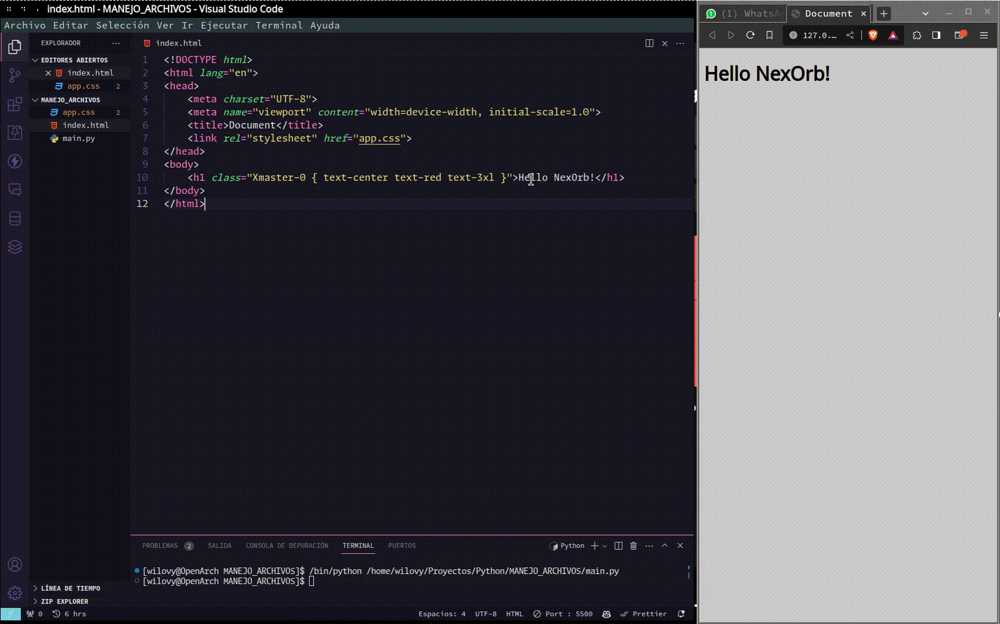

# NexOrb

Es una herramienta que admite código html estilizado con TailwindCSS y te devuelve una clase de css con el estilo que le corresponde.

Sabemos que con CSS se puede hacer lo mismo y hacerlo mucho mejor, pero tampoco esta mal usar Tailwind, es una herramienta que te permite desarrollar muy rapido.

La idea es poder seguir usando clases como Tailwind, pero tener una `clase maestra` en la que puedas englobar todas tus clases en un archivo CSS, asi solo dejas en el codigo tu clase maestra.

```html
<h1 class="titulo{ text-center text-red-500 }">Hello NexOrb</h1>
```

```css
/* CSS generado */
.titulo{
  text-align:center;
  --tw-text-opacity: 1;
  color: rgb(239 68 68 / var(--tw-text-opacity));
}
```

```html
<!-- Ahora puedes quitar las clases de TailwindCSS -->
<h1 class="titulo">Hello NexOrb</h1>
```

Básicamente, la idea es que puedas escribir tu código con Tailwind y que NexOrb te devuelva una clase con el estilo que le corresponde.

Este video de aqui es donde hicimos un testeo para ver si era posible crear NexOrb, en la que puedes ver como ""funciona"".



## TODO

* [x] Crear la web básica
* [ ] Crear un parser para Tailwind
* [ ] Crear un paquete npm
